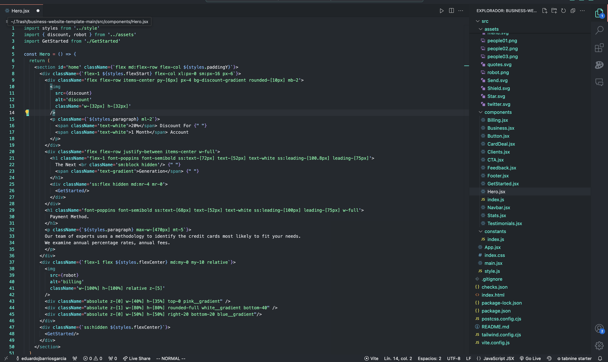

# Neon Blue Dark Theme


This is a custom theme based on neon blue I designed for myself and which I been using for the past 3 years.

`Recently, due to popular demand, I have decided to release this personal theme on GitHub. It will also soon be available on the Visual Studio Code Marketplace.`

## Description

The Neon Blue Dark Theme is a tailored theme for Visual Studio Code, inspired by the popular GitHub Dark Theme. It features custom modifications aimed at improving visual appeal and usability. The theme incorporates neon-like colors, such as `#00ffe1`, to enhance the visibility and ease of use during programming sessions.

## Screenshot

Here is a preview of the theme applied in Visual Studio Code:




## Applying the Theme Manually

To apply the Neon Blue Dark Theme to Visual Studio Code manually (As it hasn't been uploaded to VSC marketplace yet), follow these steps:

1. Open Visual Studio Code.
2. Go to the "Settings" by clicking on the gear icon in the lower-left corner or by pressing `Ctrl + ,` (`Cmd + ,` at mac devices).
3. In the search bar at the top, type "settings.json" and select "Preferences: Open Settings (JSON)" from the dropdown.
4. In the opened "settings.json" file, locate the sections for `"workbench.colorCustomizations"` and `"editor.tokenColorCustomizations"`.
5. Replace the existing content in these sections with the content from the file ./themes/neonbluetheme.json.
6. Save the "settings.json" file `(Ctrl + S)` (`(Cmd + S)` at mac devices) Or simply go to `File>Save` at the top menu.
7. Close and reopen Visual Studio Code for the changes to take effect.

## Note:

In my original version, the terminal is in encoded white. However, to complete the experience with a neon blue style `#00ffe1`, you should modify the directive:


```json
"terminal.foreground": "#ffffff"
```
and switch it to:

```json
"terminal.foreground": "#00ffe1"
```


