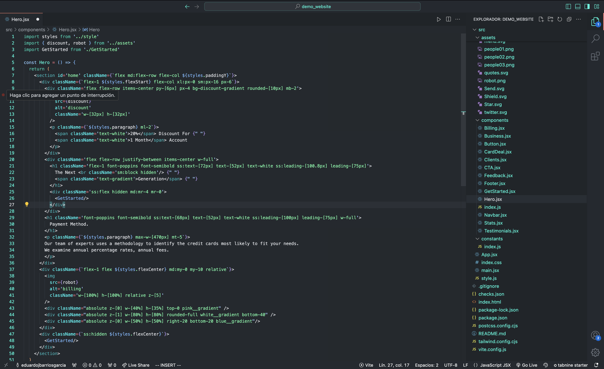

# NeonDark Theme

This is a custom theme based on neon blue I designed for myself and which I been using for the past 3 years.

## Description

The NeonDark Theme is a tailored theme for Visual Studio Code, inspired by the popular GitHub Dark Theme. It features custom modifications aimed at improving visual appeal and usability. The theme incorporates neon-like colors, such as `#00ffe1`, to enhance the visibility and ease of use during programming sessions.

## Screenshot

Here is a preview of the theme applied in Visual Studio Code:

